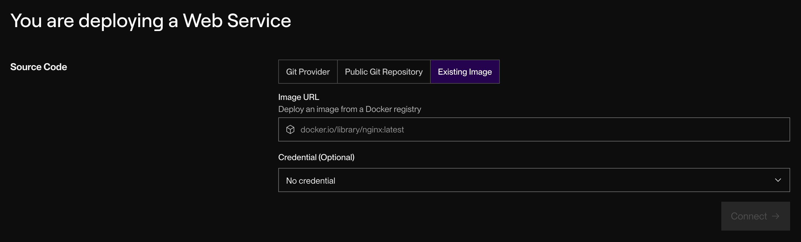
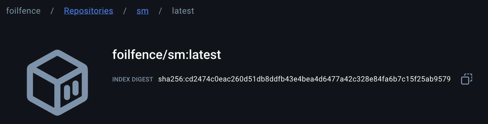

# Siteminder Email Sender Exercise
## How to Run Locally

Add a file `application.properties` in your project root and provide the following parameters:

```
spring.application.name=emailsender

mail.default.provider=mailgun

sendgrid.api.key=YOUR-API-KEY
sendgrid.from.email=YOUR-WHITELISTED-EMAIL-ADDRESS

mailgun.api.url=YOUR-API-URL
mailgun.api.key=YOUR-API-KEY
mailgun.from.email=Your-Test-User (also provided by mailgun)
```

Use your IDE to build the project or run `mvn clean install`


Execute the main class `EmailSenderApplication` to allow the API to listen and respond to requests

## How to Deploy Using Docker, Docker Hub and Render

### Generating the jar file
To package your application with Maven run: `mvn clean package`

Maven will create your jar file in a directory called `/target`

### Adding / Modifying the Docker file
This dockerfile will be used to create the docker image that we will deploy on Render
```
FROM eclipse-temurin:17-jdk-alpine
VOLUME /tmp
COPY target/*.jar app.jar
ENTRYPOINT ["java","-jar","/app.jar"]
```

### Building a docker image from our Spring project
It is recommended to have Docker or Docker Desktop installed separately

Run: `docker build -t emailsender .` 

Once successful, your image will also show up on Docker Desktop:


### Uploading our docker image to Docker Hub
Create an account on Docker Hub (same credentials as Docker works) and also create a repository

Login to Docker Hub using the terminal in docker desktop ```login -u YOUR-USER-NAME```

Alternatively you can also click login when prompted in docker desktop

After that use the docker tag command to give our emailsender service image a new name.

```
docker tag emailsender YOUR-USER-NAME/sm
```

We can then push our renamed image onto Docker Hub

```
docker push YOUR-USER-NAME/sm:latest
```

### Deploying on Render
Create an account and afterwards click new web service



Enter the url as provided in Docker Hub for example



Choose the free tier and wait for the application to be deployed. The URL will be displayed in the Render dashboard

## Implementation Details

Use of Registry pattern to manage existing and future email providers: each provider must be registered using a unique identifier.

New providers can be added by creating additional implementations with no changes needed in our service class. This demonstrates loose coupling as it no longer explicitly calls on each Provider instance, providing easier maintanability and to extend further.

Providers can also be prioritized one over the other when iterating in the registry, allowing the fail-safe logic to implemented or changes easily.

It also centralizes provider configurations, to monitor and manage our current implementation.

`GlobalExceptionHandler` is annotated as `@ControllerAdvice` to mark the class as a central exception handling component, in this case for a single controller but it can cover future controllers if more api paths are needed

Errors are returned as JSON Objetcs with field names as keys and validation messages as values.

Whitelisting is implemented by both APIs to the point where only non-free providers are recommended by sendgrid while mailgun requires each recipient to be validated and whitelisted.

## Future Enhancements

Allow enabling / disabling of providers in properties

Load balancing between providers by using weighted algorithms to distribute requests across multiple providers

Dynamic prioritization based on provider health, limits or response time

Integrate with observability plugins to monitor provider performance for maintenance and debugging


